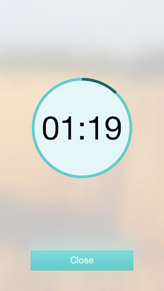

YGBlurTimer
===========

YGBlurTimer is a custom UIView useful to represent timer as circle with blur background.

It uses [MDRadialProgress] and [JCRBlurView]:



## Documentation

### Installation

Copy `YGBlurTimerViewController.{h|m}` files and `JCRBlurView`, `MDRadialProgress` folders into your project.

### Usage

There is an extensive example included in `ViewController.m`: 

```
YGBlurTimerViewController *timerVC = [[YGBlurTimerViewController alloc] initWithTimerValue:90];
[self presentViewController:timerVC animated:YES completion:nil];
```

You can also change the colors and images in `[YGBlurTimerViewController loadView]` method

## License

YGBlurTimer is released under the MIT-license (see the LICENSE file)

[MDRadialProgress]:https://github.com/mdinacci/MDRadialProgress 
[JCRBlurView]:https://github.com/JagCesar/iOS-blur
